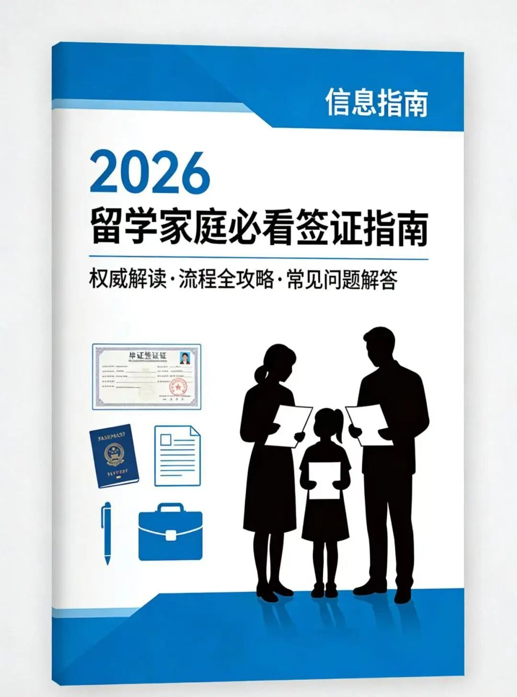
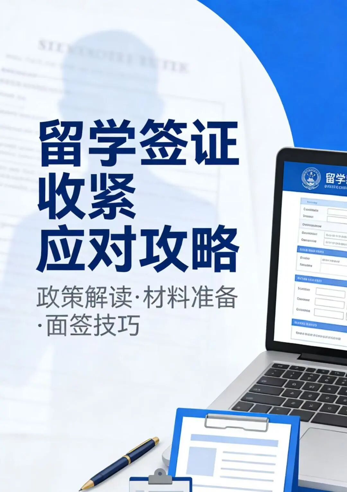
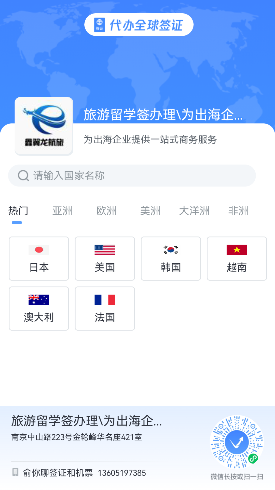

# 2026留学签证大收紧！美加澳英新政解析，留学家庭必看

**作者**: 鑫翼龙出国
**原文链接**: https://mp.weixin.qq.com/s?src=11&timestamp=1776394082&ver=6665&signature=BxEoQk2HoWqNZMABXrjTaEgpbTQkH3dH7cFTo6T0UxGs10vb0d3d7i7tF74gclb5d3yxAMCUgJur5hw-326lrZkdQA4W3HgjleKtjFn5gvhpjkT2kuhJW2NAuGlgnysm&new=1
**抓取时间**: 2026-04-17 10:48:40

---
2026年开年至今，全球主要留学目的地国家累计发布签证相关政策调整超过20项，涉及美国、英国、加拿大、澳大利亚等中国学生主要留学目的国 其中多数国家呈现“收紧”趋势——审核趋严、资金门槛提升、材料要求加码，彻底改变了留学申请的底层逻辑。 对于计划2026年及之后出国的留学家庭而言，理解这些新政的核心脉络，已不再是简单的信息储备，而是决定申请成败的关键前提。 今天这篇推文，详细解析美加澳英留学签证新政，帮你避开误区、顺利办签。  
 新政整体趋势：美加澳英集体收紧，3大核心变化 
 • 审核趋严：增加社交媒体审查、面谈概率，强化真实留学目的核查 • 资金门槛提升：提高生活费证明标准，资金来源要求更严格 • 材料要求加码：新增省级证明、课程衔接说明等材料，缺一不可 
 分国家解析：美加澳英留学签证新政细节 
 （一）美国：收紧审核+增加费用，理工科需额外注意 
 美国留学签证新政核心是 “收紧免面谈+强化审查+提升费用”，具体如下： 
 1. 免面谈政策收紧：2025年10月1日起，实行一人一申请，仅两类人群可申请：① B类签证续签者（需满足原签证有效期内/过期不超12个月、上次获签满18岁、采集过十指指纹、无拒签史）；② 外交及公务签证申请者（需提供官方证明）。即便符合条件，仍有30%概率被要求现场面谈。 2. 新增审查要求：F类签证需提交近5年Facebook、TikTok等社交媒体使用记录，签证官核查真实出行目的，避免移民倾向。 3. 费用提升：SEVIS费用调整为450美元，另需缴纳250美元诚信费，办签成本增加。 4. 理工科特殊要求：需提前4周申请ATAS证书，审批周期延长，建议提前规划时间。 
 温馨提示：美国已将签证保证金政策扩展至38个国家，部分B1/B2签证申请人需缴纳5000-15000美元可退还保证金，虽主要针对商务旅游签，但反映移民审核收紧趋势，留学家庭需突出回国约束力。 
 （二）加拿大：配额压缩+资金加码 预科生限制升级 加拿大新政收紧趋势最明显，核心集中在3个方面： 
 1. 学签配额压缩：2026年计划发放约18万份需省级证明信的学签，相比此前再砍7%，竞争压力大幅增加（目标：2027年底临时人口占比降至5%以下）。 2. 资金门槛提升： 最低生活费证明从20635加元上调至22895加元（涨幅10.95%） 举例：硕士年学费28000加元，需证明资金不少于50895加元（生活费+学费）。 要求：资金需为现金存款、担保投资凭证等可验证形式，存期≥6个月，资金来源清晰可追溯。 3. 预科签证新规： 预科/衔接课程学生签证有效期=课程长度+90天，取消此前1年缓冲期，需在课程结束后3个月内申请新学签。 4. 材料要求加码： 所有学签申请需提供省份签发的省级录取信（公立硕士、博士豁免），审核周期7-15个工作日； 跨专业硕士需提交课程衔接说明，本科申请需提供高考成绩。 关键数据：加拿大国际学生学签批准率较2024年下降 3.2个百分点，拒签主因：材料不完整（41%）、资金来源不清（36%）。 
 （三）澳大利亚：审核趋严+语言提升，GTE声明引入AI筛查 
 澳洲新政核心是 “控制留学生总量、提升合规性”，具体要求： 1. 审核趋严：针对印度、巴基斯坦等南亚国家申请人，频繁援引“母国学习条款”拒签（认为申请人在母国已有同等学历/工作经历，留学目的存疑）。 2. 申请人注意：办签文书需阐明留澳学习对自身职业发展的不可替代性，避免选择与已有背景高度重叠的课程。 3. 费用与语言要求：国际学生签证费上调至2000澳元，语言要求提升至雅思6.0水平。 4. GTE声明优化：引入AI技术筛查学习动机，对材料真实性、逻辑性要求更高，建议提前完善声明。 
 （四）英国：全面进入电子签时代，流程简化但要求更严 
 英国新政最核心变化是“纯数字化签证”，具体细节： 1. 电子签落地：2026年2月25日起，停止发放纸质签证贴纸，所有签证信息电子化，与护照绑定，入境仅需出示护照。 2. 关键注意：护照信息需与电子系统完全匹配，护照更新需同步更新电子签证记录，否则影响入境。 3. 留学生福利：电子签证可作为就医、银行开户的数字身份证，无需携带实体BRP卡。 4. 申请要求：中国大陆居民需通过UKVI官网在线申请（提前3个月可申请，审核5-10个工作日） 提前准备材料预留缓冲期。 
 留学家庭应对建议（3点核心） 
 1. 资金筹备前置化：至少提前12个月启动资金规划，确保资金来源清晰可溯，满足各国生活费、学费要求；
2. 材料准备精细化：针对各国新增要求（如省级录取信、课程衔接说明）提前准备，逐一核对清单，避免缺失；
3. 时间规划弹性化：预留充足办理周期，应对审核周期延长、材料补充等问题，尤其是理工科、跨专业申请人。  后续我们会持续更新各国留学签证政策，大家有任何疑问，都可以在评论区留言，我们会为大家提供专业的办签建议。 