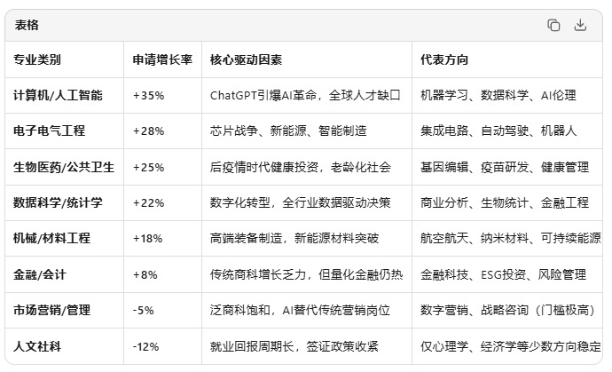
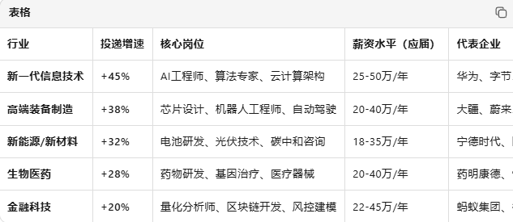
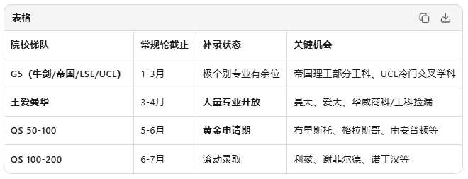
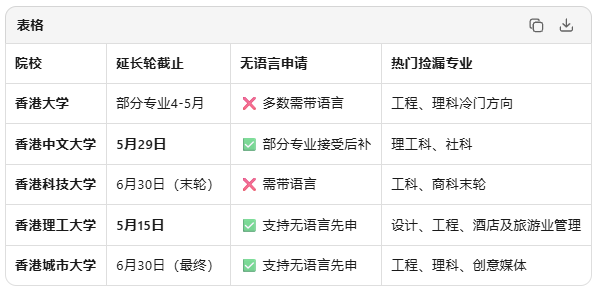
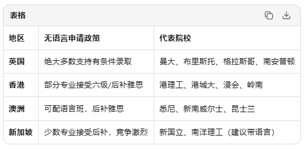
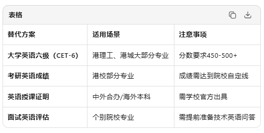
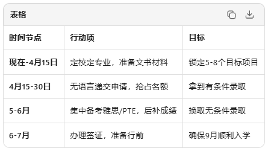
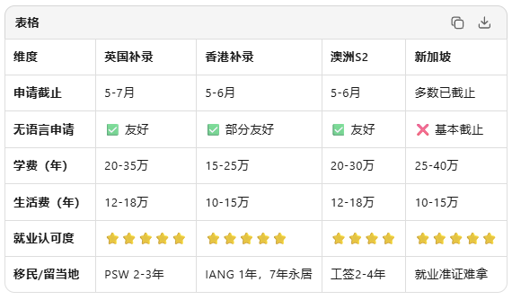

# 2026留学新趋势：理工科屠榜，商科退潮！3-4月英港补录窗口开启，无语言可冲！

**作者**: 澳锦出国留学
**原文链接**: https://mp.weixin.qq.com/s?src=11&timestamp=1776394090&ver=6665&signature=UsLfdc4io1hoLNM7YIOYXFyh*k2ZywrSqE7wVEneSi*ePlzKHPlPwm69n2j513e3LarJrH8YERdEUuvIvwHs6vMZKKp0BalSpNgQKr0ycJ4gUt4a5gFsXlzc2lmC63yc&new=1
**抓取时间**: 2026-04-17 10:49:02

---
   2026留学新趋势： 理工科屠榜，商科退潮！ 重磅！         
 
 
 2026年3月，留学申请进入"黄金捡漏期"—— 当ChatGPT重构全球产业格局，当"新质生产力"成为国策关键词，留学专业选择正在经历一场静默革命：计算机稳居申请首位，理工科、医科持续升温，商科热度悄然回落。 
 与此同时，英国、香港硕士补录窗口在3-4月全面开启，多数院校支持无语言先申，这是2026Fall最后的上岸机会！ 
 
  1 专业风向：理工科屠榜，商科"退烧" “  关键洞察： "文转码""商转工"成为2026年最显著的跨申趋势，但顶尖理工科项目对数学、编程先修课要求严苛，盲目跟风易碰壁。 
 
 
  2 就业红利：新质产业成海归"主阵地" “  政策红利： "新质生产力"写入2024年政府工作报告，高端制造、信息技术、新能源成为国家重点扶持领域，海归人才落户、创业补贴、科研经费支持力度空前。 
 
 
  3 捡漏关键：3-4月英港补录窗口期 “ 1 英国：滚动录取，"先到先得"进入倒计时  英国补录优势： - ✅ 无语言可先申：多数院校接受"有条件录取"，后补雅思/PTE
- ✅ 1年制硕士：时间成本低，2026年9月入学，2027年即毕业
- ✅ PSW签证保留：毕业生签证2-3年，留英工作窗口仍在 
 
 2 香港：延长轮次，最后机会  香港补录红利： - ✅ QS排名集体跃升：港大#11、港中文#32、港科大#44，学历含金量暴涨
- ✅ 无语言先申：港理工、港城大等支持用六级/考研英语/后补雅思
- ✅ 留港就业：IANG签证1年，7年转永居，大湾区就业认可度高 
 
 
  4 无语言申请操作指南：3步搞定 “ 1 定位"无语言友好"院校  
 2 用替代方案证明英语能力  
 3 3-4月紧急行动清单  
 
 
  5 2026Fall最后窗口：英港 vs 其他选择 
  策略建议： - 预算有限+求快：香港（1年制，总成本25-40万）
- 专业深度+留英工作：英国（PSW保留，行业资源丰富）
- 移民导向+气候舒适：澳洲（工签长，移民政策友好） 
 
 当理工科成为新宠，当商科热度回落，当英港院校延长申请窗口——3-4月的每一个决策，都可能改变你的留学轨迹。 
 无语言先申不是"将就"，而是"策略"——用有条件录取锁定名额，用2-3个月冲刺语言成绩，用最终offer换取无条件录取。这是时间管理的艺术，也是信息差的红利。 
 现在行动，还能赶上2026年9月的入学班车。再拖延，就只能等2027年了。 
 
 【 END】 如果有需要或者有更多疑问，可以后台私信咨询澳锦留学顾问哦！ 关注澳锦出国留学公众号，每天分享留学、移民新资讯！  微信号 丨 AUSKING123 小红书丨 澳锦出国留学