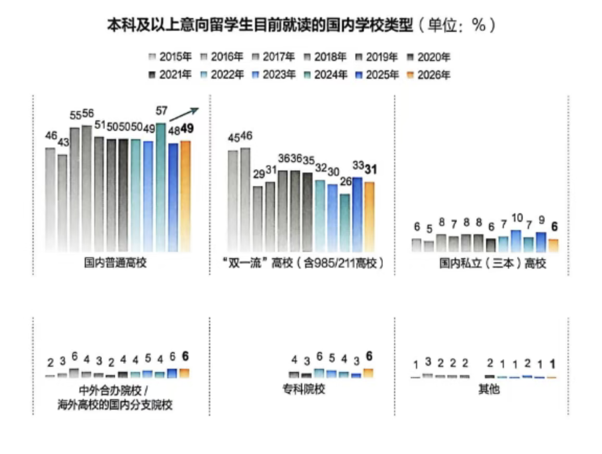
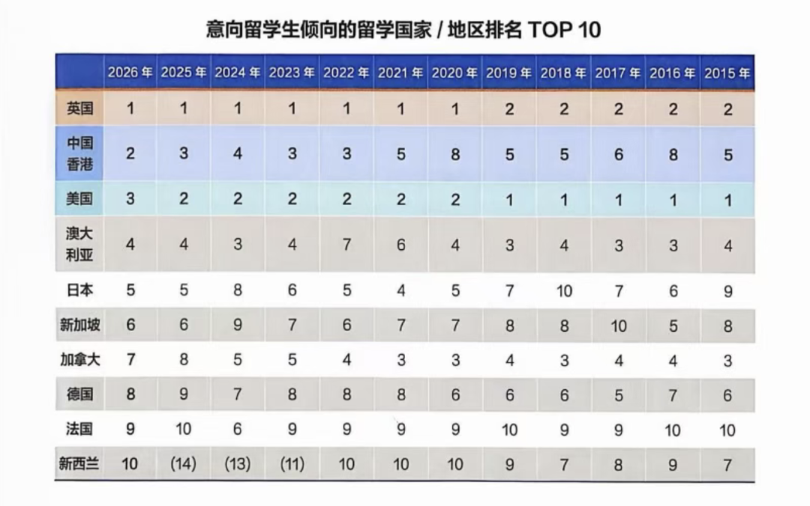
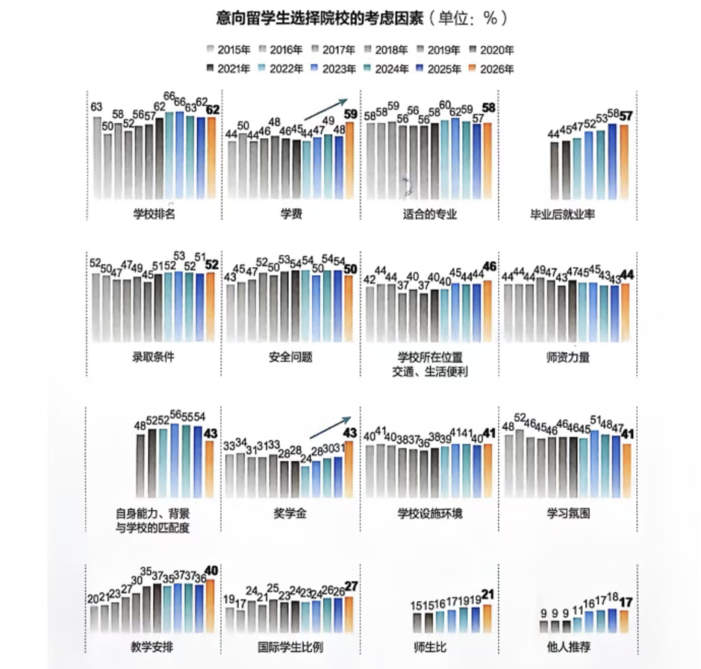
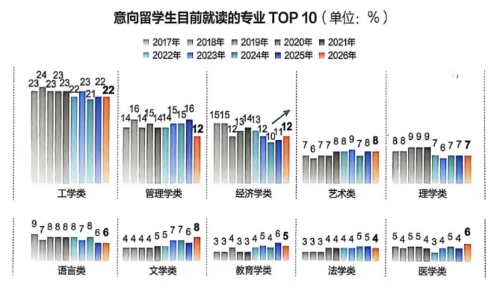
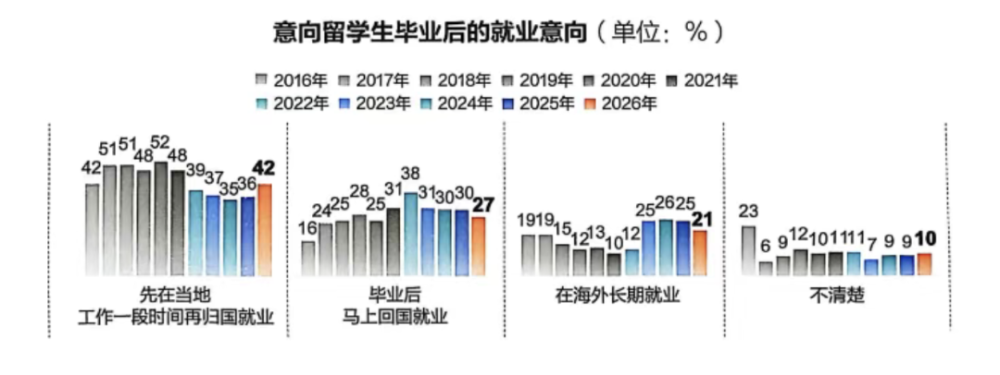
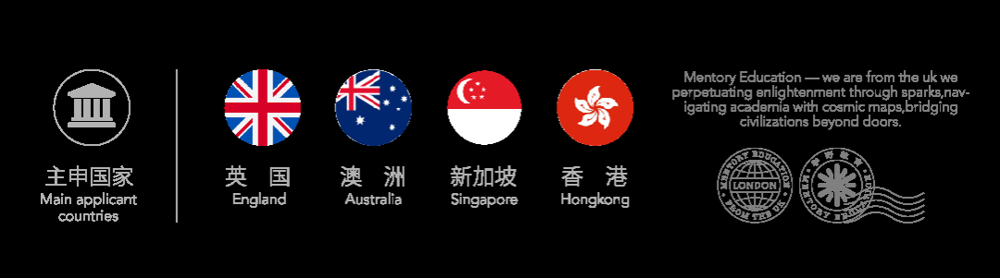

# 从“冲名校”到“看回报”：2026留学新趋势曝光，英国第一、中国香港爆发

**作者**: M.E学野
**原文链接**: https://mp.weixin.qq.com/s?src=11&timestamp=1776394099&ver=6665&signature=K3DJLYeZSD4Xkd07qXNk*7YodQKCQ*Uso5TgLVBTpLdUm85GMZTvy3KP1wAhkU5jKdWDzaDzR8XQzu9o-p0ihl0SjlJehgacGmFBpZe1rLoQih5usJuVmfdcbkJKg8Jp&new=1
**抓取时间**: 2026-04-17 10:49:24

---
🌟欢迎点击上方蓝字“ M.E.学野 ”关注我 点击右上角 “ .... ” 菜单,选择“ 设为星标 ”✨ ❤️ 门启四海  学野无疆 ❤️ P ursue your dream & Share your enthusiasm 3月17日，新东方发布了最新一版《中国学生出国留学发展报告》。如果说过去大家谈留学，更多是在讨论“去哪儿”“申什么学校”，那么这份报告真正揭示的，其实是另一层更重要的变化： 今天的留学，已经不只是教育选择，更是一场关于学历、成本、就业、回报与长期规划的综合决策 。 从数据来看，2026年的中国留学市场出现了几个非常清晰的新信号： 高等教育阶段依旧是留学主力，本科群体持续扩张；英国连续七年位居热门留学目的地榜首；中国香港首次冲入TOP2；工科继续领跑，经济学热度上升；学生与家庭的决策方式也从“名校优先”转向“质量、成本、就业并重”。 这意味着，留学这件事，正在进入一个 更理性、更多元、也更讲究回报 的新阶段。 01 # 留学不再是少数人的选择，高等教育依旧是绝对主场 报告显示，2026年中国学生的留学意向继续走高。尤其在高等教育阶段，留学已经成为越来越多家庭的重要选项。 其中， 本科在读学生的留学意向占比达到63%，创下近12年来新高 ；再叠加硕博群体的深造需求， 高等教育阶段的整体留学意向占比已经升至77% 。换句话说，今天中国学生的留学市场，依然是以本科、硕士、博士为主导，本科生更是撑起了“半边天”。 这背后反映出两个现实。第一，越来越多家庭仍然把留学视作 学历升级、学术深造和职业竞争力提升 的重要路径。第二，学生对于未来的规划也变得更早、更明确，不少人已经不满足于“国内读完再说”，而是更愿意提前布局更高的平台和更广阔的国际资源。  图源：《中国学生出国留学发展报告》 另一个值得关注的变化是， 普通院校学生正在成为留学市场中的重要力量 。报告显示，2026年国内普通高校学生的留学意向占比达到49%，长期居于各类院校首位；而在中小学阶段，公立普高学生的留学意向占比更高达55%。这说明，留学已经不再只是少数顶尖背景学生的专属选择，越来越多普通背景学生也在通过留学打开新的上升通道。 同时，拥有较强教育背景和国际视野的家长，也在持续推动市场变化。数据显示， 2026年本科及以上学历家长占比达到历史高位，其中拥有海外学历的家长已超过25% 。这类家庭往往更理解国际教育的价值，也更愿意从孩子未来发展的角度进行长线投入。 02 # 留学目的地“大洗牌”：英国继续领跑，中国香港首次跻身第二 在所有数据里，最引人关注的一项，莫过于留学目的地的变化。  图源：《中国学生出国留学发展报告》 告显示， 英国连续七年稳居中国学生意向留学国家/地区榜首。 这并不令人意外。相比其他热门目的地，英国在中国家庭心中始终具备几项非常稳定的优势： 教育质量认可度高、学制相对紧凑、申请体系成熟、语言环境明确、整体路径清晰 。对于希望尽快完成学业、提升学历、进入职场的学生来说，英国依旧是非常高效的一站式选择。 真正值得注意的是， 中国香港在2026年首次升至TOP2 ，实现明显上位。过去十余年，中国香港的热度本就在不断攀升，而这一次正式进入第二，释放出的信号非常明确： “离家近、英语授课、国际认可、成本与回报相对均衡” ，已经让中国香港成为越来越多家庭眼中的优先解。 尤其在当前整体留学环境更加理性的大背景下，中国香港的优势被进一步放大。 地缘距离更近，安全感更强；学制短，节奏快；语言与文化衔接更自然；毕业后衔接内地就业也更方便 。对于不少家庭来说，这种“国际化教育+亚洲区位便利”的组合，恰好踩中了当下最核心的择校需求。 与之对应，美国则受到政策波动、成本压力等因素影响，整体排名滑至第三。澳大利亚、日本、新加坡、加拿大、德国、法国、新西兰等地依旧保持稳定热度，说明留学市场正在形成更典型的 多目的地并存格局 。 简单来说，今天的学生已经不再只盯着单一国家，而是在做一件更现实的事： 用全球联申来分散风险、拓宽机会 。 03 # 从“冲一个国家”到“多地联申”，留学家庭越来越会算账了 报告里有一个非常鲜明的关键词： 联申。 越来越多学生和家长开始意识到，留学申请不能再“把鸡蛋放在一个篮子里”。数据显示， 超过半数的意向留学生计划同时申请2—3个国家或地区的高校 ，英国、中国香港、美国成为最常见的联申搭配。 这种变化背后的逻辑其实非常清楚。 一方面，单一目的地会面临政策、签证、录取、费用等多重不确定性；另一方面，全球范围内优质教育资源更多元，学生完全可以根据自身背景做更有弹性的组合申请。 因此，“全球联申”已经不只是多投几所学校这么简单，而是成为一种更成熟的申请策略。它既能降低政策波动带来的风险，也能提升整体录取成功率，同时还给学生保留了更多后续选择空间。 换句话说，如今留学家庭的思维已经从“我最想去哪”变成了 “哪里最适合我、哪里更稳、哪里更值” 。 04 # 择校逻辑升级：名校仍重要，但“性价比”与“就业回报”更关键了  图源：《中国学生出国留学发展报告》 如果说过去很多家庭做留学决策时，最核心的问题是“学校够不够有名”，那么现在这个问题已经悄悄变成了： 这所学校值不值、适不适合、毕业后能不能顺利转化为就业优势 。 报告显示，在意向留学生选择院校时， 学校排名、适合的专业、毕业后就业率 依旧是最受关注的三大因素，这说明名校光环依旧重要，优质教育资源仍然具有强吸引力。 但与此同时，一个变化也非常明显： 学费已经上升为第二大择校因素，奖学金的重要性也在持续提升。 这意味着，家庭在决策时明显变得更理性了。 比起单纯追求“名校情结”，现在大家更在意的是： 这所学校的投入产出比高不高；花出去的钱，最后能不能变成学历价值与职业回报；这条路对我的家庭来说是否可持续。 在这样的逻辑下，留学选择逐渐形成一种 “质量与成本兼顾” 的新模型。学生既要看学校排名，也会看专业是否对口；既会看城市资源，也会衡量总预算；既关心学术氛围，也越来越关注未来就业率和落地可能性。 这也是为什么近年来，英国、中国香港、澳大利亚、新加坡等地会持续吸引中国学生——它们并不一定在所有维度都最强，但往往能在 教育质量、学制效率、成本控制和就业转化 之间提供一个更平衡的答案。 05 # 专业赛道也在变化：工科继续称王，经济学热度持续走高 在专业选择上，报告给出的结论同样非常清晰： 务实化与多元化并行。  图源：《中国学生出国留学发展报告》 其中， 工学类专业继续领跑，2026年占比达到22% ，已经连续十年位居前列。工科长期稳定受欢迎，并不难理解。无论是全球范围内的产业需求，还是中国学生对就业适配性的重视，工科始终都是“确定性较高”的选择。尤其是在AI、智能制造、电子信息、工程技术、新能源等方向持续扩张的背景下，工科的“全球通用性”依旧很强。 除了工科， 经济学专业这几年也在稳步升温，2026年占比升至12% 。这说明学生的选择正在进一步向“综合能力+职业转化”靠拢。经济学本身兼具理论深度、行业延展性与就业通用性，无论是继续申请金融、商业分析、政策研究，还是进入咨询、互联网、数据相关领域，都具备不错的衔接空间。 另外， 文学类、医学类等专业占比也在稳步提升 ，说明当前申请人群的兴趣和路径正在变得更加多元。过去那种“热门专业极度集中”的情况正在被打破，越来越多学生开始从个人兴趣、职业方向、国家匹配度等多维度做选择。 06 # 毕业去向也变了：先海外蓄力，再回国发展，正成为主流选择 报告中关于就业去向的一组数据，也非常值得关注。  图源：《中国学生出国留学发展报告》 2026年，42%的意向留学生倾向于毕业后先在留学地工作一段时间，再择机回国发展。 这说明，“先海外蓄力、再回国发展”正在成为最主流的就业路径之一。 这个趋势背后，其实反映了学生越来越务实。相比过去“毕业立刻回国”或者“长期留在海外”的二元选择，现在更多人愿意采用一种折中但更具竞争力的方式： 先利用海外平台积累经验、补足履历，再回到国内市场完成职业跃迁。 这既说明国内用人单位对海外工作经验的认可度仍在，也说明留学生自身已经不再把留学视作单纯拿学历，而是把它纳入到长期职业规划里。 与此同时，就业选择也出现了明显的“求稳”倾向。报告提到，直接找工作依旧是海归的主流选择，占比达到68%；而“考公/考编”的实际比例已经达到15%，比预期计划高出不少。这说明在复杂的就业环境下，留学生在回国发展时也越来越重视确定性和稳定性。  
  从这份《中国学生出国留学发展报告》里，我们能看得很清楚： 今天的留学市场，已经从“名校崇拜”走向“综合决策”，从“单点申请”走向“全球配置”，从“拿文凭”走向“学历+能力+职业回报”的整体规划。 英国继续稳居第一，中国香港强势上升，工科与经济学持续受欢迎，联申成为主流，家庭越来越在意成本、奖学金、就业率与长线发展——这些变化都说明， 留学正在进入一个更成熟、更务实的新阶段。 对于学生和家长来说，接下来的关键已经不是“别人去哪里”，而是： 我适合什么国家？适合什么专业？我的预算、背景、目标，最适合走哪条路？ 这也意味着，未来真正拉开差距的，不只是成绩，而是 信息判断力、规划能力和路径设计能力。 如果你也正在准备英国留学，或者想同时考虑英国、中国香港、新加坡、澳洲等多地联申路线，接下来最重要的，不是盲目跟风，而是 尽早做出适合自己的申请布局 。  END  本科、硕士留学申请/转学/学术/argue等欢迎咨询，现在咨询即赠留学咨询大礼包，让你的留学之路信息更通达！点击下面二维码，喵~~  